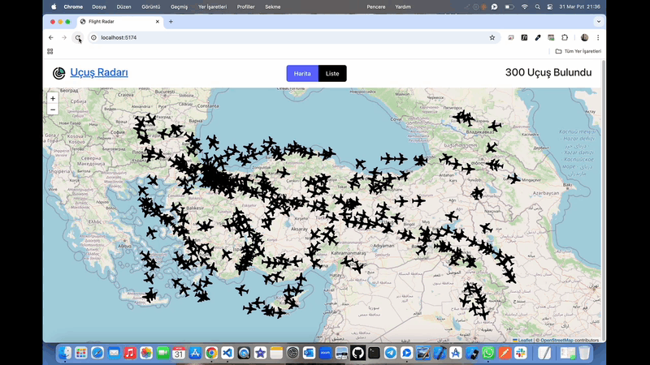

# Flight Radar ✈️

<li>Bu proje kullanıcı dostu yapısıyla tasarlanmış uçuş bilgilerini gerçek zamanlı erişebileceğiniz bir radar sitesidir.</li>
<li>Projede uçuş sayısı,detayları,kalkış varış noktaları,uçaklara ait veriler mevcuttur.</li>

# Kullanılan Teknolojiler 🎨

<li>⭐ React</li>
<li>⭐ Redux</li>
<li>⭐ Vite</li>
<li>⭐ Leaflet</li>
<li>⭐ Toolkit</li>
<li>⭐ Bootstrap</li>
<li>⭐ Axios</li>
<li>⭐ React Paginate</li>
<li>⭐ React-Icons</li>

# Ekran Görüntüsü 🎥
      

# İletişim 📩
yunusemreoral@hotmail.com.tr

